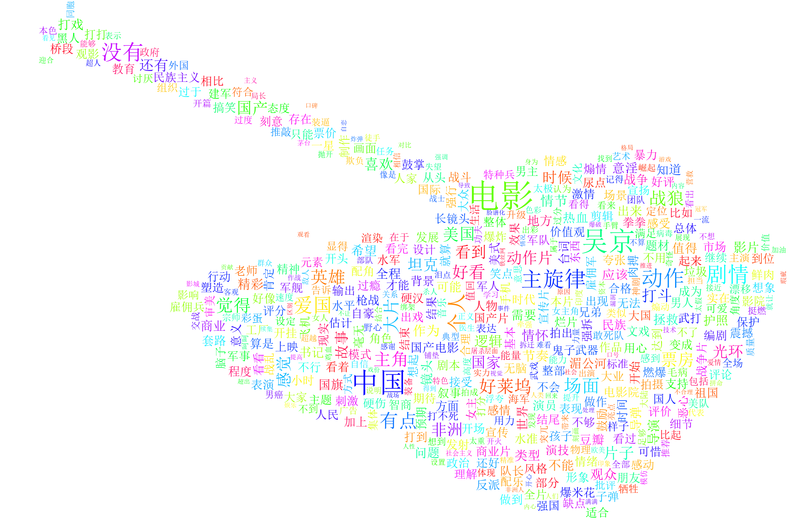

核心内容分为以下几步：
- 1st. 爬取豆瓣电影上的《战狼2》点击率最高的10000个热门评论；
- 2nd. 使用jieba分词得到前500个高频词以及对应的频度；
- 3rd. 调用wordcloud库，绘制词云。

## 安装相关库
pip安装jieba, wordcloud

    $ pip install jieba
    $ pip install wordcloud

## 运行
爬取豆瓣电影上《战狼2》的热门评论。需要运行一段时间，为避免意外中断，将程序挂到后台运行。
    
    $ nohup python zhanlang_spider.py &

爬虫运行完毕后，将爬取的评论进行分词，并做成词云，运行：

    $ python analyze_comment.py

**生成的词云**

